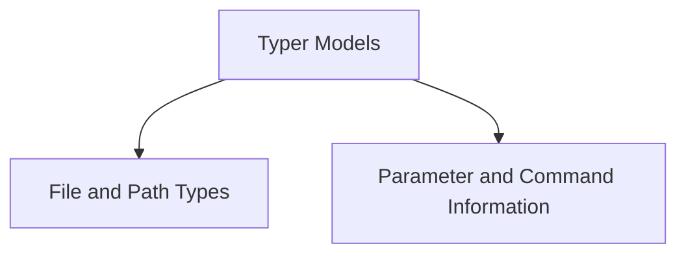

# Typer Models Documentation

## Introduction and Purpose

The `typer_models` module is a foundational component of the Typer framework, providing the core data structures and information models that define how command-line interfaces are constructed. It encapsulates the blueprints for arguments, options, commands, and various utility types like file handlers, ensuring consistency and structured data management across Typer applications.

## Architecture Overview

The `typer_models` module acts as the central repository for critical metadata and object definitions used by other Typer modules, such as `typer_core` (for command parsing) and `typer_main` (for application execution). It is composed of two main sub-modules:

- **File Types**: Manages specific data types for file and path interactions.
- **Parameter and Command Information**: Stores detailed metadata about CLI parameters, arguments, options, and commands.

This separation allows for a clear distinction between data model definitions and their processing logic, enhancing modularity and maintainability.

<!-- DIAGRAM_JSON
{
    "direction": "TD",
    "nodes": [
        {"id": "file_types", "label": "File and Path Types", "type": "module", "link": "file_types.md"},
        {"id": "parameter_and_command_info", "label": "Parameter and Command Information", "type": "module", "link": "parameter_and_command_info.md"}
    ],
    "edges": [
        {"source": "typer_models", "target": "file_types"},
        {"source": "typer_models", "target": "parameter_and_command_info"}
    ],
    "groups": []
}
-->

## Sub-modules

### [File and Path Types](file_types.md)
This sub-module defines custom types and classes for handling various file and path-related operations within Typer. It includes components for reading and writing text and binary files, as well as general path handling. For more details, refer to the [File and Path Types documentation](file_types.md).

### [Parameter and Command Information](parameter_and_command_info.md)
This sub-module is responsible for encapsulating all metadata and configuration related to Typer parameters, arguments, options, and commands. It provides structures to define default values, callback functions, and other essential information for building robust command-line interfaces. For more details, refer to the [Parameter and Command Information documentation](parameter_and_command_info.md).
