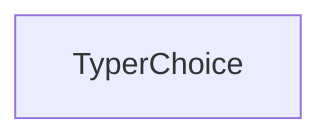

# typer_types Module Documentation

## Introduction

The `typer_types` module is a fundamental part of the Typer framework, responsible for defining custom data types and structures used throughout the library. Its primary purpose is to enhance type hinting for command-line interface (CLI) applications, providing a robust mechanism for input validation and clearer definition of parameter expectations. This module helps developers create more resilient and user-friendly CLIs by enforcing specific data constraints.

## Architecture and Core Components

The `typer_types` module primarily encapsulates the `TyperChoice` component, which is crucial for defining parameters that accept a restricted set of values. While seemingly simple, this component is foundational for building interactive and error-resistant CLI tools.

<!-- DIAGRAM_JSON
{
    "direction": "TD",
    "nodes": [
        {"id": "typer_choice", "label": "TyperChoice", "type": "component", "link": null}
    ],
    "edges": [],
    "groups": []
}
-->

### TyperChoice

`TyperChoice` is a specialized type definition that allows Typer applications to specify a list of valid choices for an argument or option. When a parameter is annotated with `TyperChoice`, Typer automatically handles the validation of user input against the provided choices. If the input does not match any of the defined choices, an appropriate error message is displayed to the user, guiding them to provide valid input.

This component is extensively used by other modules, particularly within `typer_core` to define `TyperArgument` and `TyperOption` instances with constrained values, and potentially by `typer_models` for defining `ParameterInfo` objects that encapsulate these choice restrictions.

## Module Relationships

The `typer_types` module, through its `TyperChoice` component, plays a critical role in defining the behavior and validation of command-line parameters. It does not directly depend on many other Typer modules but is a crucial dependency *for* them.

-   **typer_core**: `typer_core` (see [typer_core.md](typer_core.md)) utilizes `TyperChoice` when defining `TyperArgument` and `TyperOption` to specify allowed values for command-line inputs.
-   **typer_models**: `typer_models` (see [typer_models.md](typer_models.md)) might integrate `TyperChoice` definitions into its `ParameterInfo` and `ArgumentInfo` objects to store and manage the metadata related to parameter choices.

This module provides the underlying "type" for choice-based parameters, ensuring consistency and strong typing across the Typer application. Its integration helps in generating better help messages and enabling more robust CLI parsing.