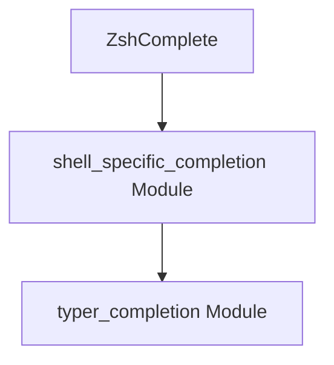

# `zsh_completion` Module Documentation

## Introduction

The `zsh_completion` module is a specialized component within the `typer_completion` ecosystem, solely dedicated to generating shell completion scripts for Zsh. It encapsulates the logic required to produce accurate and functional completion suggestions for applications built with Typer when run in a Zsh environment.

## Core Functionality

This module's primary responsibility is handled by its core component:

*   **`ZshComplete`**: This component is responsible for generating the specific Zsh completion script. It provides the necessary functions and logic to interpret Typer application structure and translate it into Zsh-compatible completion directives, allowing users to benefit from tab-completion for commands, arguments, and options.

## Architecture and Component Relationships

The `zsh_completion` module is a leaf module focusing on Zsh-specific completion generation. It integrates into the broader shell completion framework provided by the `shell_specific_completion` and `typer_completion` modules, utilizing their generalized mechanisms to produce tailored Zsh output.

<!-- DIAGRAM_JSON
{
    "direction": "TD",
    "nodes": [
        {"id": "zsh_complete", "label": "ZshComplete", "type": "component", "link": null},
        {"id": "shell_specific_completion", "label": "shell_specific_completion Module", "type": "external", "link": "shell_specific_completion.md"},
        {"id": "typer_completion", "label": "typer_completion Module", "type": "external", "link": "typer_completion.md"}
    ],
    "edges": [
        {"source": "zsh_complete", "target": "shell_specific_completion"},
        {"source": "shell_specific_completion", "target": "typer_completion"}
    ],
    "groups": []
}
-->

## How it Fits into the Overall System

The `zsh_completion` module serves as the Zsh-specific implementation for shell completion within the Typer framework. It is invoked when a Typer application needs to generate completion scripts for Zsh users. It relies on the higher-level abstractions and common logic defined in the [shell_specific_completion module](shell_specific_completion.md) and ultimately the [typer_completion module](typer_completion.md) to ensure consistent and correct completion behavior across different shells, while providing the specific formatting and syntax required by Zsh.
