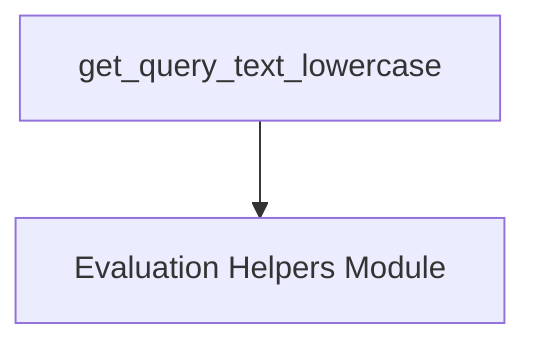

# `dom_query_helpers` Module Documentation

## Introduction

The `dom_query_helpers` module provides essential utility functions for interacting with and extracting information from the Document Object Model (DOM) within the evaluation harness. Its primary function is to simplify the retrieval of text content from web pages, specifically by providing a method to fetch and normalize query results to lowercase.

## Core Functionality

This module encapsulates functions that assist in querying DOM elements and processing their text content. The main component is designed to ensure consistency in text comparisons and data extraction by converting retrieved text to lowercase.

### `get_query_text_lowercase`

Retrieves the text content of a specified DOM element and converts it to lowercase. This function is particularly useful for case-insensitive comparisons and standardized data handling during evaluations.

**Component Path:** `evaluation_harness.helper_functions.get_query_text_lowercase`

**Signature:**
```python
def get_query_text_lowercase(page: Page | PseudoPage, selector: str) -> str:
    # ... implementation ...
```

**Parameters:**
- `page`: An object representing the web page, which can be either a `Page` or `PseudoPage` instance, providing the context for DOM queries.
- `selector`: A CSS selector string used to identify the target DOM element.

**Returns:**
- A string representing the lowercase text content of the element matched by the `selector`.

**Internal Dependencies:**
This function internally relies on `get_query_text` (from the same `evaluation_harness.helper_functions` module) to initially retrieve the text content before converting it to lowercase.

## Architecture and Component Relationships

The `dom_query_helpers` module is a leaf module within the broader [evaluation_helpers](evaluation_helpers.md) module. It provides specialized DOM querying capabilities that are leveraged by various evaluation scripts and components needing to extract and process text from web pages.

<!-- DIAGRAM_JSON
{
    "direction": "TD",
    "nodes": [
        {"id": "get_query_text_lowercase", "label": "get_query_text_lowercase", "type": "component", "link": null},
        {"id": "evaluation_helpers", "label": "Evaluation Helpers Module", "type": "external", "link": "evaluation_helpers.md"}
    ],
    "edges": [
        {"source": "get_query_text_lowercase", "target": "evaluation_helpers"}
    ],
    "groups": []
}
-->



## How the Module Fits into the Overall System

As part of the `evaluation_helpers` suite, `dom_query_helpers` plays a crucial role in the evaluation harness by providing a robust and consistent way to interact with the DOM. It ensures that data extracted from web pages, particularly text content, is standardized (e.g., always lowercase) for accurate comparisons and subsequent processing by evaluators. This module contributes to the reliability and accuracy of automated evaluations across various tasks that involve web interaction and content validation.