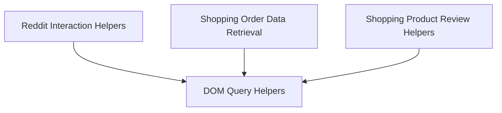

# Evaluation Helpers Module

## Introduction
The `evaluation_helpers` module provides a collection of utility functions designed to assist in the evaluation harness. These helpers facilitate interactions with various platforms like Reddit and a shopping website, and provide general DOM querying capabilities to extract specific data points required for automated testing and validation.

## Architecture Overview
The `evaluation_helpers` module is structured into several sub-modules, each focusing on a distinct area of helper functionality:

<!-- DIAGRAM_JSON
{
    "direction": "TD",
    "nodes": [
        {"id": "dom_query_helpers", "label": "DOM Query Helpers", "type": "module", "link": "dom_query_helpers.md"},
        {"id": "reddit_helpers", "label": "Reddit Interaction Helpers", "type": "module", "link": "reddit_helpers.md"},
        {"id": "shopping_order_helpers", "label": "Shopping Order Data Retrieval", "type": "module", "link": "shopping_order_helpers.md"},
        {"id": "shopping_product_review_helpers", "label": "Shopping Product Review Helpers", "type": "module", "link": "shopping_product_review_helpers.md"}
    ],
    "edges": [
        {"source": "reddit_helpers", "target": "dom_query_helpers"},
        {"source": "shopping_order_helpers", "target": "dom_query_helpers"},
        {"source": "shopping_product_review_helpers", "target": "dom_query_helpers"}
    ],
    "groups": []
}
-->

## Sub-modules

### [DOM Query Helpers](dom_query_helpers.md)
This sub-module contains general utility functions for querying and extracting information from the Document Object Model (DOM). It provides foundational capabilities for interacting with web page elements.

### [Reddit Interaction Helpers](reddit_helpers.md)
This sub-module provides specialized functions for interacting with Reddit-specific elements. It includes helpers for fetching comment content and identifying parent comment usernames by a given user.

### [Shopping Order Data Retrieval](shopping_order_helpers.md)
This sub-module focuses on functions for retrieving order-related information from the shopping platform. It allows for fetching the latest order URL and detailed product information within an order, such as product names, quantities, and options.

### [Shopping Product Review Helpers](shopping_product_review_helpers.md)
This sub-module offers utilities for extracting detailed product review information, including the author, rating, text, and title of the latest review. It also provides a function to retrieve the product page URL based on a given SKU.
