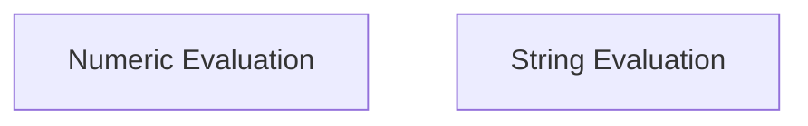

# Evaluator Implementations Module

## Introduction

The `evaluator_implementations` module provides core functionalities for evaluating agent outputs, specifically focusing on numeric and string-based comparisons. It houses various evaluator classes designed to assess the correctness of responses against predefined criteria.

## Architecture Overview

The module is structured into specialized sub-modules, each handling a distinct type of evaluation. The overall architecture is designed for extensibility, allowing new evaluation methods to be easily integrated.

<!-- DIAGRAM_JSON
{
    "direction": "TD",
    "nodes": [
        {"id": "numeric_evaluation", "label": "Numeric Evaluation", "type": "module", "link": "numeric_evaluation.md"},
        {"id": "string_evaluation", "label": "String Evaluation", "type": "module", "link": "string_evaluation.md"}
    ],
    "edges": [],
    "groups": []
}
-->

## Sub-modules

### [Numeric Evaluation](numeric_evaluation.md)

This sub-module focuses on evaluating numerical correctness. It includes utilities for converting strings to integers and performing various inequality comparisons with support for floating-point tolerance.

### [String Evaluation](string_evaluation.md)

The `string_evaluation` sub-module handles soft string comparisons. It leverages text generation metrics like ROUGE to assess the similarity and correctness of textual answers, providing a flexible way to evaluate non-exact string matches.
