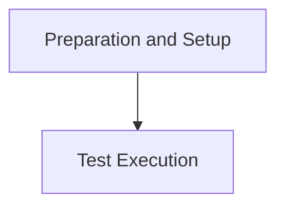

# Execution Management Module

## Introduction

The `execution_management` module is responsible for orchestrating the running of automated tests and demonstrations within the system. It encompasses the core logic for preparing the environment, executing agent actions in a browser, and managing the overall test or demo lifecycle. This module ensures that agents can interact with web environments effectively and that results are properly captured and evaluated.

## Architecture Overview

The module is structured into two main sub-modules:
- `preparation_and_setup`: Handles initial environment setup and result directory management.
- `test_execution`: Manages the actual execution of tests and demos, including agent interaction and evaluation.

<!-- DIAGRAM_JSON
{
    "direction": "TD",
    "nodes": [
        {"id": "preparation_and_setup", "label": "Preparation and Setup", "type": "module", "link": "preparation_and_setup.md"},
        {"id": "test_execution", "label": "Test Execution", "type": "module", "link": "test_execution.md"}
    ],
    "edges": [
        {"source": "preparation_and_setup", "target": "test_execution"}
    ],
    "groups": []
}
-->

## Sub-modules

### [Preparation and Setup](preparation_and_setup.md)
This sub-module manages the initial setup and preparation steps required before test or demo execution. This includes converting prompt Python files to JSON and initializing the result directories for storing logs and traces.

### [Test Execution](test_execution.md)
This sub-module contains the core logic for running automated tests and demos. It involves constructing the agent, setting up the browser environment, handling agent actions, managing the trajectory of interactions, and evaluating the outcomes against predefined criteria. It also includes mechanisms for early stopping and error handling during execution.
