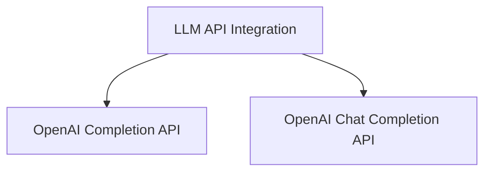

# LLM API Integration

The `llm_api_integration` module serves as the primary interface for interacting with Language Model (LLM) APIs, specifically focusing on OpenAI's services. It provides a standardized and asynchronous way to generate responses from both the OpenAI Completion API and Chat Completion API.

## Architecture Overview

This module is designed to abstract away the direct API calls, offering a consistent method for interacting with different OpenAI endpoints. It manages API key validation, rate limiting, and result parsing, ensuring robust and efficient communication with the LLM providers.

<!-- DIAGRAM_JSON
{
    "direction": "TD",
    "nodes": [
        {"id": "openai_completion_api", "label": "OpenAI Completion API", "type": "module", "link": "openai_completion_api.md"},
        {"id": "openai_chat_completion_api", "label": "OpenAI Chat Completion API", "type": "module", "link": "openai_chat_completion_api.md"}
    ],
    "edges": [
        {"source": "llm_api_integration", "target": "openai_completion_api"},
        {"source": "llm_api_integration", "target": "openai_chat_completion_api"}
    ],
    "groups": []
}
-->

## Sub-modules

### OpenAI Completion API ([openai_completion_api.md](openai_completion_api.md))
This sub-module is responsible for handling asynchronous generation of responses using the OpenAI Completion API. It provides the core functionality to send prompts and receive text completions from OpenAI's older completion models.

### OpenAI Chat Completion API ([openai_chat_completion_api.md](openai_chat_completion_api.md))
This sub-module manages asynchronous generation of responses using the OpenAI Chat Completion API. It facilitates interaction with OpenAI's newer chat-based models, allowing for conversational turns and structured message inputs.
