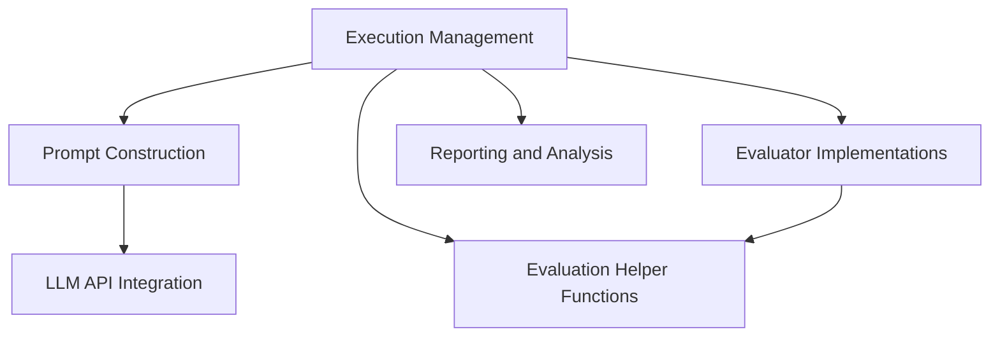

# Main Module Documentation

## Introduction
The main module serves as the central orchestration point for running tests, demonstrations, and managing the overall system workflow. It integrates various sub-modules responsible for agent prompt construction, environment interaction, evaluation, and result analysis. This module is critical for executing tasks, collecting performance metrics, and providing insights into the system's operational efficiency.

## Architecture Overview
The main module\'s architecture is designed around several key sub-modules that interact to perform complex tasks. The diagram below illustrates the relationships and data flow between these components.

<!-- DIAGRAM_JSON
{
    "direction": "TD",
    "nodes": [
        {"id": "execution_management", "label": "Execution Management", "type": "module", "link": "execution_management.md"},
        {"id": "prompt_construction", "label": "Prompt Construction", "type": "module", "link": "prompt_construction.md"},
        {"id": "evaluation_helpers", "label": "Evaluation Helper Functions", "type": "module", "link": "evaluation_helpers.md"},
        {"id": "evaluator_implementations", "label": "Evaluator Implementations", "type": "module", "link": "evaluator_implementations.md"},
        {"id": "llm_api_integration", "label": "LLM API Integration", "type": "module", "link": "llm_api_integration.md"},
        {"id": "reporting_and_analysis", "label": "Reporting and Analysis", "type": "module", "link": "reporting_and_analysis.md"}
    ],
    "edges": [
        {"source": "execution_management", "target": "prompt_construction"},
        {"source": "execution_management", "target": "evaluation_helpers"},
        {"source": "execution_management", "target": "evaluator_implementations"},
        {"source": "prompt_construction", "target": "llm_api_integration"},
        {"source": "evaluator_implementations", "target": "evaluation_helpers"},
        {"source": "execution_management", "target": "reporting_and_analysis"}
    ],
    "groups": []
}
-->

## Sub-modules

### [Execution Management](execution_management.md)
This module handles the core logic for running both automated tests and interactive demonstrations. It prepares the execution environment, initializes agents, and manages the step-by-step interaction with the browser environment.

### [Prompt Construction](prompt_construction.md)
Responsible for dynamically generating and formatting prompts that guide the agent's behavior. It supports different prompt constructors, including those for multimodal reasoning and direct action prediction, adapting to the specific requirements of the underlying language model.

### [Evaluation Helper Functions](evaluation_helpers.md)
A collection of utility functions designed to assist in extracting and processing data during the evaluation phase. These helpers provide specific functionalities for interacting with various web platforms like Reddit and shopping sites to retrieve relevant information for assessment.

### [Evaluator Implementations](evaluator_implementations.md)
Contains the concrete implementations of evaluation strategies. This includes evaluators for comparing numerical values and soft evaluators that utilize natural language processing metrics (e.g., ROUGE) to assess the quality of generated text responses.

### [LLM API Integration](llm_api_integration.md)
This module provides the necessary interfaces and utilities for communicating with Large Language Model (LLM) providers, specifically OpenAI. It manages asynchronous requests to both completion and chat completion APIs, ensuring efficient and throttled access to external language models.

### [Reporting and Analysis](reporting_and_analysis.md)
Focuses on the post-execution analysis of results. This includes calculating overall success rates, breaking down performance by various criteria such as website or task type, and generating reports to summarize the system's effectiveness.
