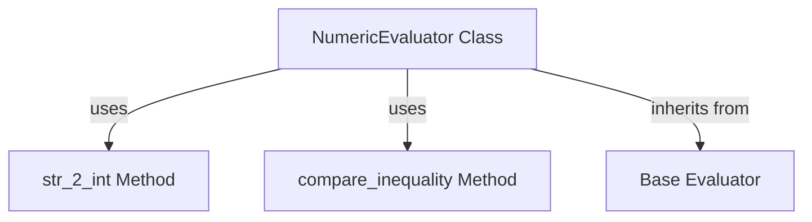

# numeric_evaluation Module Documentation

## Introduction

The `numeric_evaluation` module is a specialized component within the `evaluator_implementations` package, primarily responsible for evaluating numerical relationships in agent outputs. It provides robust functionality for converting string representations of numbers to integers and performing comparisons against various inequality conditions, essential for validating quantitative predictions or results.

## Architecture and Component Relationships

The `numeric_evaluation` module centers around the `NumericEvaluator` class, which extends a base `Evaluator` class. It encapsulates methods for safe string-to-integer conversion and flexible inequality comparisons.

<!-- DIAGRAM_JSON
{
    "direction": "TD",
    "nodes": [
        {"id": "numeric_evaluator_class", "label": "NumericEvaluator Class", "type": "component", "link": null},
        {"id": "str_2_int_method", "label": "str_2_int Method", "type": "component", "link": null},
        {"id": "compare_inequality_method", "label": "compare_inequality Method", "type": "component", "link": null},
        {"id": "evaluator_base", "label": "Base Evaluator", "type": "external", "link": "evaluator_implementations.md"}
    ],
    "edges": [
        {"source": "numeric_evaluator_class", "target": "str_2_int_method", "label": "uses"},
        {"source": "numeric_evaluator_class", "target": "compare_inequality_method", "label": "uses"},
        {"source": "numeric_evaluator_class", "target": "evaluator_base", "label": "inherits from"}
    ],
    "groups": []
}
-->

### Core Functionality

#### `NumericEvaluator` Class

The `NumericEvaluator` class is designed to perform numerical assessments. It contains two static methods: `str_2_int` for converting strings to integers and `compare_inequality` for evaluating numerical relationships based on inequality strings. This class is a concrete implementation of the abstract `Evaluator` class, as detailed in the [evaluator_implementations module documentation](evaluator_implementations.md).

#### `str_2_int(s: str) -> Optional[int]`

This static method safely attempts to convert a given string `s` into an integer. It handles common numerical string formats by removing commas and stripping whitespace. If the conversion fails due to a `ValueError` (e.g., the string is not a valid integer representation), it prints an error message and returns `None`, preventing application crashes.

#### `compare_inequality(value: Union[int, float], inequality: str, tol: float = 1e-8) -> bool`

This static method compares a numerical `value` (either an integer or a float) against a specified `inequality` string (e.g., `"< 700"`, `">= 300"`). It supports various comparison operators (`<=`, `>=`, `==`, `<`, `>`) and includes a tolerance `tol` for robust floating-point comparisons. A `ValueError` is raised if the provided `inequality` string is not valid.

## How it Fits into the Overall System

The `numeric_evaluation` module is a crucial part of the overall evaluation harness, specifically within the [evaluator_implementations module](evaluator_implementations.md). It provides the specific logic for numerically-focused evaluations, complementing other evaluators like the `string_evaluation` module, which handles string-based comparisons.

It is utilized during the `run.test` and `run_demo.test` processes, where agent outputs are assessed against expected numerical outcomes. For example, if an agent is tasked with extracting a numerical quantity, the `NumericEvaluator` would verify the correctness of that extracted number based on predefined conditions. This module ensures the quantitative accuracy of an agent's responses, contributing to the overall reliability and performance metrics generated by the [reporting_and_analysis module](reporting_and_analysis.md).
