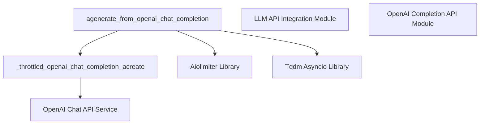

# openai_chat_completion_api

## Introduction
The `openai_chat_completion_api` module provides the core functionality for asynchronously interacting with OpenAI's Chat Completion API. It encapsulates the logic for making API requests, managing rate limits, and processing responses, serving as a critical bridge between the application and OpenAI's chat models.

## Module Overview
This module is a specialized component within the [llm_api_integration](llm_api_integration.md) ecosystem, focusing exclusively on OpenAI's chat-based models. Its primary function, `agenerate_from_openai_chat_completion`, is designed to handle multiple asynchronous requests to the OpenAI Chat API efficiently. It incorporates rate-limiting mechanisms using `aiolimiter` to ensure compliance with API usage policies and robust error handling for API key validation. The module is crucial for any part of the system requiring dynamic, conversational text generation using OpenAI's powerful chat capabilities.

## Architecture

<!-- DIAGRAM_JSON
{
    "direction": "TD",
    "nodes": [
        {"id": "agenerate_chat_completion", "label": "agenerate_from_openai_chat_completion", "type": "component", "link": null},
        {"id": "throttled_chat_acreate", "label": "_throttled_openai_chat_completion_acreate", "type": "component", "link": null},
        {"id": "openai_api_service", "label": "OpenAI Chat API Service", "type": "external", "link": null},
        {"id": "aiolimiter_lib", "label": "Aiolimiter Library", "type": "external", "link": null},
        {"id": "tqdm_asyncio_lib", "label": "Tqdm Asyncio Library", "type": "external", "link": null},
        {"id": "llm_api_integration", "label": "LLM API Integration Module", "type": "external", "link": "llm_api_integration.md"},
        {"id": "openai_completion_api", "label": "OpenAI Completion API Module", "type": "external", "link": "openai_completion_api.md"}
    ],
    "edges": [
        {"source": "agenerate_chat_completion", "target": "throttled_chat_acreate"},
        {"source": "agenerate_chat_completion", "target": "aiolimiter_lib"},
        {"source": "agenerate_chat_completion", "target": "tqdm_asyncio_lib"},
        {"source": "throttled_chat_acreate", "target": "openai_api_service"}
    ],
    "groups": []
}
-->

The `openai_chat_completion_api` module's architecture is centered around the `agenerate_from_openai_chat_completion` asynchronous function. This function orchestrates the interaction with the OpenAI Chat API by:
1.  **Rate Limiting:** Utilizing the `Aiolimiter Library` to control the frequency of requests to the OpenAI API, preventing exceeding rate limits and ensuring stable operation.
2.  **Asynchronous Execution:** Leveraging `Tqdm Asyncio Library` to efficiently manage and track progress of multiple concurrent API calls.
3.  **API Interaction:** Delegating the actual call to the `OpenAI Chat API Service` through an internal helper, `_throttled_openai_chat_completion_acreate`, which handles the low-level communication.

This module is a direct child of the [llm_api_integration](llm_api_integration.md) module, which serves as a higher-level abstraction for interacting with various LLM providers. It operates in parallel with the [openai_completion_api](openai_completion_api.md) module, distinguishing its functionality by focusing specifically on chat-based interactions as opposed to traditional completion tasks.