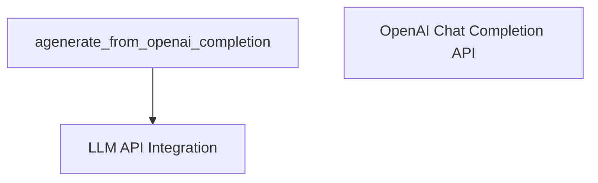

# openai_completion_api Module Documentation

The `openai_completion_api` module provides an asynchronous interface for interacting with the OpenAI Completion API. It encapsulates the logic for sending requests, managing rate limits, and processing responses from OpenAI's text generation models.

## Purpose and Core Functionality

This module's primary purpose is to facilitate reliable and efficient text generation using the OpenAI Completion API. Its core functionality is centered around the `agenerate_from_openai_completion` function, which enables asynchronous generation of responses for multiple prompts while adhering to API rate limits.

Key features include:
*   Asynchronous execution for efficient handling of multiple prompts.
*   Built-in rate limiting using `aiolimiter` to prevent exceeding OpenAI API quotas.
*   Environment variable-based API key management for secure authentication.

## Architecture and Component Relationships

The `openai_completion_api` module is a leaf module within the [llm_api_integration](llm_api_integration.md) sub-system. It focuses on a single core function and its immediate dependencies.

<!-- DIAGRAM_JSON
{
    "direction": "TD",
    "nodes": [
        {"id": "agenerate_from_openai_completion", "label": "agenerate_from_openai_completion", "type": "component", "link": null},
        {"id": "llm_api_integration", "label": "LLM API Integration", "type": "external", "link": "llm_api_integration.md"},
        {"id": "openai_chat_completion_api", "label": "OpenAI Chat Completion API", "type": "external", "link": "openai_chat_completion_api.md"}
    ],
    "edges": [
        {"source": "agenerate_from_openai_completion", "target": "llm_api_integration"}
    ],
    "groups": []
}
-->

### Core Components

*   **`agenerate_from_openai_completion`**:
    *   **Description**: An asynchronous function that sends a list of prompts to the OpenAI Completion API and returns the generated text responses. It manages parameters like `engine`, `temperature`, `max_tokens`, `top_p`, `context_length`, and `requests_per_minute`.
    *   **Dependencies**:
        *   **Environment Variables**: Requires `OPENAI_API_KEY` to be set.
        *   **`aiolimiter`**: Used for `aiolimiter.AsyncLimiter` to control the rate of API calls.
        *   **`tqdm_asyncio`**: Leveraged for `tqdm_asyncio.gather` to concurrently execute multiple asynchronous API requests.
        *   **Internal Helper**: Calls `_throttled_openai_completion_acreate` for individual API requests with built-in throttling.

## How the Module Fits into the Overall System

The `openai_completion_api` module serves as a specific implementation for interacting with OpenAI's older Completion API. It is part of the broader [llm_api_integration](llm_api_integration.md) layer, which aims to provide a unified interface for various LLM providers.

It operates in parallel with the [openai_chat_completion_api](openai_chat_completion_api.md) module, which handles the newer chat-based interactions. Modules like [prompt_construction](prompt_construction.md) would prepare prompts that this module then sends to the OpenAI API for response generation. The responses obtained from this module can then be utilized by other parts of the system, such as [evaluation_harness](evaluation_harness.md) for analysis.
