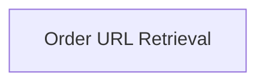

<!-- AUTO_GENERATED_PLACEHOLDER
  reason: LLM did not create .md file for this module
  module_path: main/evaluation_helpers/shopping_order_helpers/order_retrieval
  component_count: 1
  generated_at: 2026-02-03T15:26:48.767687
  TODO: Fix LLM prompt to handle small leaf modules
-->

# Order URL Retrieval

> ⚠️ **Auto-Generated Placeholder**
> This documentation was auto-generated because the LLM failed to create it.
> Module path: `main/evaluation_helpers/shopping_order_helpers/order_retrieval`

Handles the retrieval of the latest order's URL from the shopping platform.

## Components

This module contains 1 component(s):

- `evaluation_harness.helper_functions.shopping_get_latest_order_url`

## Structure

---
*Auto-generated placeholder. See sync_issues.json for details.*
