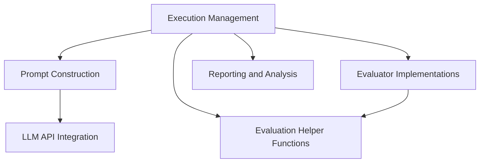

The `visualwebarena` repository serves as a comprehensive framework for running tests and demonstrations of agents interacting with web environments. It acts as a central orchestration point, managing the overall system workflow, including agent prompt construction, environment interaction, evaluation, and detailed result analysis. The repository is designed to facilitate the development and assessment of agents capable of performing complex tasks within a visual web arena.

### Architecture Overview

The core architecture of `visualwebarena` is composed of several interconnected modules that manage the lifecycle of agent execution, from prompt generation to result reporting.

