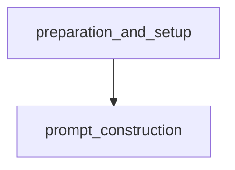

# Preparation and Setup Module

## Introduction
The `preparation_and_setup` module is responsible for initializing the environment before agent execution or demo runs. It handles essential pre-computation tasks, such as converting prompt files into a standardized JSON format and setting up the necessary directory structure for storing results and execution traces. This ensures that the agent has a clean and organized workspace to operate within, and that all required resources are in place before starting its main tasks.

## Architecture Overview

The module primarily consists of two core preparation functions: `run.prepare` and `run_demo.prepare`. Both functions perform identical setup steps, ensuring consistency whether the system is being run for testing or demonstration purposes. These functions interact with the [prompt_construction](prompt_construction.md) module to process prompts and manage file system operations for result storage.

<!-- DIAGRAM_JSON
{
    "direction": "TD",
    "nodes": [
        {"id": "preparation_and_setup", "label": "Preparation and Setup", "type": "module", "link": "preparation_and_setup.md"},
        {"id": "prompt_construction", "label": "Prompt Construction", "type": "module", "link": "prompt_construction.md"}
    ],
    "edges": [
        {"source": "preparation_and_setup", "target": "prompt_construction", "label": "depends on"}
    ],
    "groups": []
}
-->

## Core Functionality

This module encapsulates the following key functionalities:

### 1. Prompt File Conversion
It converts Python-based prompt definitions into a JSON format. This standardization facilitates easier consumption by other parts of the system and ensures that prompts are consistently structured. This functionality is delegated to the `agent.prompts.to_json.run()` utility, which is part of the [prompt_construction](prompt_construction.md) module.

### 2. Result Directory Management
The module ensures the existence and proper structure of the `result_dir`. If a result directory is not explicitly provided, it automatically generates a timestamped directory within `cache/results/`. It also creates a `traces` subdirectory within the `result_dir` to store detailed execution logs.

### 3. Log File Tracking
It maintains a record of all log files generated during execution, appending the current session's log file name to `log_files.txt` within the `result_dir`.

## Components

### run.prepare
This function is called during a standard agent run to set up the environment. It performs prompt conversion and initializes the result directory structure, including a `traces` folder and a log file tracker.

### run_demo.prepare
Identical in functionality to `run.prepare`, this function is specifically used for preparing the environment for demonstration runs. It ensures the same rigorous setup procedures are followed for demos as for full test runs.
