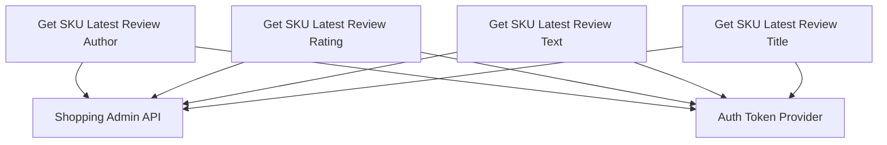

# Product Review Fetchers Module

## Introduction

The `product_review_fetchers` module is a vital component within the evaluation harness, specifically designed to interact with the shopping administration system to retrieve detailed information about product reviews. It provides a set of helper functions to fetch the latest review's author, rating, text, and title for a given product SKU. This module ensures that review data is accurately extracted for evaluation and analysis purposes.

## Architecture and Component Relationships

This module encapsulates functions that directly query the shopping API. Each function focuses on retrieving a specific piece of information from the latest product review. It relies on an authentication token to secure its API calls.

<!-- DIAGRAM_JSON
{
    "direction": "TD",
    "nodes": [
        {"id": "sku_review_author", "label": "Get SKU Latest Review Author", "type": "component", "link": null},
        {"id": "sku_review_rating", "label": "Get SKU Latest Review Rating", "type": "component", "link": null},
        {"id": "sku_review_text", "label": "Get SKU Latest Review Text", "type": "component", "link": null},
        {"id": "sku_review_title", "label": "Get SKU Latest Review Title", "type": "component", "link": null},
        {"id": "shopping_api", "label": "Shopping Admin API", "type": "external", "link": null},
        {"id": "auth_token", "label": "Auth Token Provider", "type": "external", "link": null}
    ],
    "edges": [
        {"source": "sku_review_author", "target": "shopping_api"},
        {"source": "sku_review_author", "target": "auth_token"},
        {"source": "sku_review_rating", "target": "shopping_api"},
        {"source": "sku_review_rating", "target": "auth_token"},
        {"source": "sku_review_text", "target": "shopping_api"},
        {"source": "sku_review_text", "target": "auth_token"},
        {"source": "sku_review_title", "target": "shopping_api"},
        {"source": "sku_review_title", "target": "auth_token"}
    ],
    "groups": []
}
-->

### Core Components

-   **`shopping_get_sku_latest_review_author(sku: str) -> str`**
    *   **Purpose:** Retrieves the nickname of the author who submitted the latest review for a given product SKU.
    *   **Details:** Makes a GET request to the `/rest/V1/products/{sku}/reviews` endpoint of the shopping administration API. It expects a 200 status code and returns the `nickname` from the latest review entry in the response JSON.

-   **`shopping_get_sku_latest_review_rating(sku: str) -> str`**
    *   **Purpose:** Fetches the rating (as a percentage) of the latest review for a specified product SKU.
    *   **Details:** Similar to the author function, it queries the `/rest/V1/products/{sku}/reviews` endpoint. It extracts the `percent` value from the `ratings` array of the latest review, ensuring the `rating_name` is "Rating".

-   **`shopping_get_sku_latest_review_text(sku: str) -> str`**
    *   **Purpose:** Obtains the detailed text content of the latest review for a product SKU.
    *   **Details:** Communicates with the same reviews API endpoint and parses the `detail` field from the latest review object in the JSON response.

-   **`shopping_get_sku_latest_review_title(sku: str) -> str`**
    *   **Purpose:** Retrieves the title of the latest review associated with a product SKU.
    *   **Details:** Interacts with the shopping reviews API, extracting the `title` field from the latest review object returned in the API response.

### Dependencies

All functions in this module depend on:

*   **Shopping Admin API:** For fetching product review data.
*   **Auth Token Provider:** (`shopping_get_auth_token()`) to securely authenticate requests to the Shopping Admin API.
*   **`requests` library:** For making HTTP requests.

## System Integration

The `product_review_fetchers` module is a sub-module of [shopping_product_review_helpers](shopping_product_review_helpers.md), which in turn is part of the larger [evaluation_helpers](evaluation_helpers.md) module. It provides specific data retrieval functionalities that are crucial for the evaluation harness to assess agent performance by comparing generated responses against actual product review information. This module's output directly feeds into evaluation logic, enabling the system to verify the accuracy of information extraction related to product reviews.

Its clearly defined API for fetching review details makes it a reusable component across various parts of the system that require product review information from the shopping administration backend.