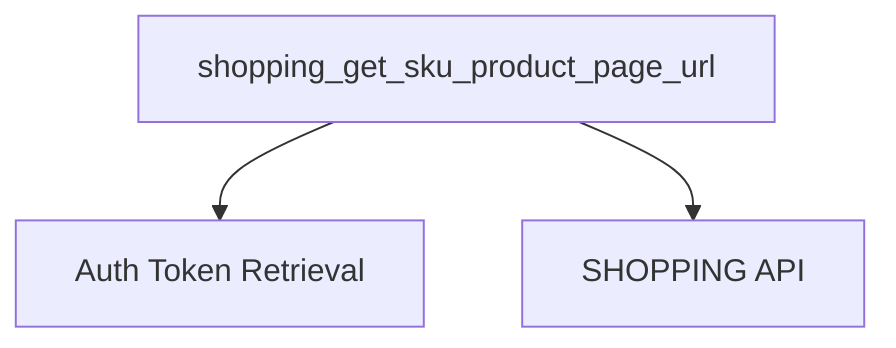

# `product_url_retrieval` Module Documentation

## Introduction

The `product_url_retrieval` module is a focused component within the larger `evaluation_helpers` system, specifically designed to facilitate the retrieval of product page URLs. Its primary function is to provide a reliable method for obtaining the direct URL to a product's detail page on an e-commerce platform, given its Stock Keeping Unit (SKU).

This module plays a crucial role in scenarios where direct access to product pages is required for various evaluation, testing, or data verification processes, particularly within the context of shopping-related tasks.

## Architecture and Component Relationships

The `product_url_retrieval` module contains a single core function responsible for its functionality. It interacts with an external shopping API and relies on an authentication mechanism to secure its API calls.

<!-- DIAGRAM_JSON
{
    "direction": "TD",
    "nodes": [
        {"id": "get_product_page_url", "label": "shopping_get_sku_product_page_url", "type": "component", "link": null},
        {"id": "auth_token_retrieval", "label": "Auth Token Retrieval", "type": "external", "link": null},
        {"id": "shopping_api", "label": "SHOPPING API", "type": "external", "link": null}
    ],
    "edges": [
        {"source": "get_product_page_url", "target": "auth_token_retrieval"},
        {"source": "get_product_page_url", "target": "shopping_api"}
    ],
    "groups": []
}
-->

### Core Components

#### `shopping_get_sku_product_page_url`

- **Description**: This function is responsible for fetching the product page URL for a given SKU. It constructs an authenticated API request to the `SHOPPING` backend, retrieves product details, and extracts the `url_key` from custom attributes to form the complete product URL.
- **Parameters**:
    - `sku` (str): The Stock Keeping Unit of the product whose page URL is to be retrieved.
- **Returns**:
    - `str`: The full URL to the product's page, or an empty string if the URL cannot be found or the product does not exist.
- **Dependencies**:
    - `Auth Token Retrieval`: Relies on an external function (`shopping_get_auth_token`) to obtain the necessary authorization token for API calls.
    - `SHOPPING API`: Makes HTTP GET requests to the configured `SHOPPING` endpoint to fetch product information.

## How the Module Fits into the Overall System

This `product_url_retrieval` module is an integral part of the `evaluation_helpers` suite, specifically nested under `shopping_product_review_helpers`. It provides a utility for obtaining canonical product URLs, which can be critical for various downstream tasks such as:

*   **Automated Testing**: Verifying that product links are correct and accessible.
*   **Data Validation**: Ensuring consistency between product SKUs and their associated URLs.
*   **Review Scraping**: Providing the entry point for tools that might scrape product reviews or details from the product page itself.
*   **Reporting**: Generating reports that include direct links to products for easy access and reference.

By centralizing this functionality, the module ensures a consistent and robust method for retrieving product URLs across the system, avoiding duplication of API interaction logic and promoting maintainability. It serves as a foundational helper for any component that requires navigating directly to product pages based on SKU information.