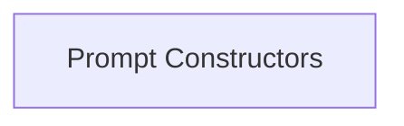

# Prompt Construction Module

The `prompt_construction` module is responsible for dynamically generating and formatting prompts for various language models. It provides specialized constructors to handle different prompting strategies, such as direct prompting and multimodal Chain-of-Thought (CoT) prompting.

## Architecture Overview

The `prompt_construction` module is composed of a single core sub-module: `prompt_constructors`, which encapsulates the logic for creating different types of prompts.

<!-- DIAGRAM_JSON
{
    "direction": "TD",
    "nodes": [
        {"id": "prompt_constructors", "label": "Prompt Constructors", "type": "module", "link": "prompt_constructors.md"}
    ],
    "edges": [],
    "groups": []
}
-->

## Sub-modules

### [Prompt Constructors](prompt_constructors.md)
This sub-module contains the implementations for various prompt construction strategies, including `MultimodalCoTPromptConstructor` and `DirectPromptConstructor`. It handles the logic for formatting input data, observations, and historical actions into a structured prompt suitable for language model APIs.