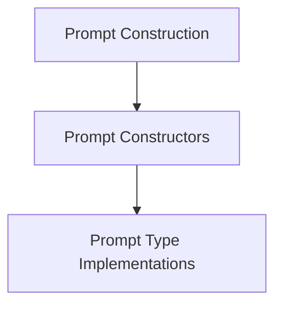

# Prompt Constructors Module

## Introduction

The `prompt_constructors` module is dedicated to defining and implementing various strategies for constructing prompts that are utilized by the agent. It provides the core logic for generating prompts tailored to different interaction modalities and reasoning paradigms, ensuring flexibility and adaptability in agent communication with Language Models.

## Architecture

The `prompt_constructors` module is a specialized component within the broader [prompt_construction.md](prompt_construction.md) module, which is responsible for the overall management of prompt creation. This module specifically houses the concrete implementations of different prompt construction types.

It acts as a foundational layer for how agents formulate their queries and instructions to large language models, drawing on system configurations and agent states to build effective prompts. While this module focuses on prompt generation, the generated prompts are consumed by the [llm_api_integration.md](llm_api_integration.md) module, which handles the interaction with various LLM providers.

<!-- DIAGRAM_JSON
{
    "direction": "TD",
    "nodes": [
        {"id": "prompt_construction", "label": "Prompt Construction", "type": "module", "link": "prompt_construction.md"},
        {"id": "prompt_constructors", "label": "Prompt Constructors", "type": "module"},
        {"id": "prompt_types", "label": "Prompt Type Implementations", "type": "module", "link": "prompt_types.md"}
    ],
    "edges": [
        {"source": "prompt_construction", "target": "prompt_constructors"},
        {"source": "prompt_constructors", "target": "prompt_types"}
    ],
    "groups": []
}
-->

## Sub-modules

This module contains the following sub-module:

### Prompt Type Implementations ([prompt_types.md](prompt_types.md))
This sub-module encapsulates the specific classes and methods responsible for creating different kinds of prompts, such as direct prompts or those involving chain-of-thought reasoning with multimodal inputs.