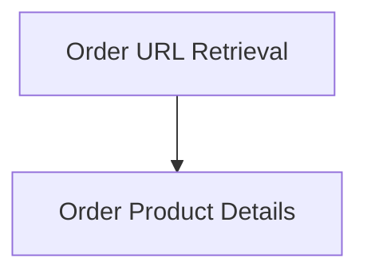

# Shopping Order Helpers Module

This module provides a collection of helper functions specifically designed for interacting with shopping order data. It facilitates tasks such as retrieving the latest order URL and extracting detailed information about products within an order, including their names, quantities, and specific options. This module is primarily used within the evaluation harness to simulate user interactions with a shopping platform and verify order-related functionalities.

## Architecture Overview

The `shopping_order_helpers` module is structured into two main sub-modules, each focusing on a distinct area of order data interaction:

<!-- DIAGRAM_JSON
{
    "direction": "TD",
    "nodes": [
        {"id": "order_retrieval", "label": "Order URL Retrieval", "type": "module", "link": "order_retrieval.md"},
        {"id": "order_product_details", "label": "Order Product Details", "type": "module", "link": "order_product_details.md"}
    ],
    "edges": [
        {"source": "order_retrieval", "target": "order_product_details"}
    ],
    "groups": []
}
-->

## Sub-modules

### [Order URL Retrieval](order_retrieval.md)
This sub-module focuses on programmatically obtaining the URL of the most recently placed order on the shopping platform. It abstracts the underlying API calls and authentication required to fetch this information.

### [Order Product Details](order_product_details.md)
This sub-module provides utilities to parse and extract specific information about products contained within an order. This includes functions to list product names, retrieve the quantity of a specific product, and fetch details for particular product options.