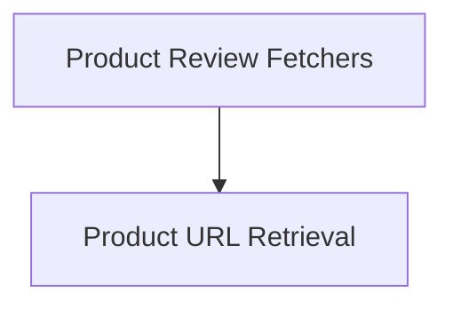

# shopping_product_review_helpers

## Introduction and Purpose

The `shopping_product_review_helpers` module provides a collection of utility functions designed to interact with the shopping platform's API to retrieve product review information and product page URLs. These helpers are crucial for evaluation harnesses and other automated processes that need to access specific details about product reviews and product listings based on SKU.

## Architecture Overview

The module is structured into two main sub-modules, each focusing on a distinct aspect of product data retrieval:

<!-- DIAGRAM_JSON
{
    "direction": "TD",
    "nodes": [
        {"id": "product_review_fetchers", "label": "Product Review Fetchers", "type": "module", "link": "product_review_fetchers.md"},
        {"id": "product_url_retrieval", "label": "Product URL Retrieval", "type": "module", "link": "product_url_retrieval.md"}
    ],
    "edges": [
        {"source": "product_review_fetchers", "target": "product_url_retrieval"}
    ],
    "groups": []
}
-->

## High-Level Functionality

### [Product Review Fetchers](product_review_fetchers.md)
This sub-module contains functions for extracting specific details from the latest product review associated with a given SKU. It provides access to the review's author, rating, text content, and title.

### [Product URL Retrieval](product_url_retrieval.md)
This sub-module offers a dedicated function to fetch the complete product page URL for a specified SKU, enabling direct navigation or referencing of product listings.