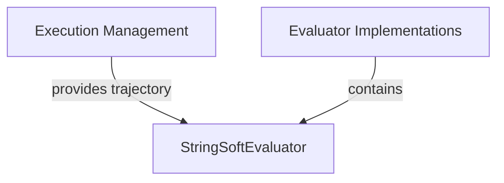

# Module: `string_evaluation`

## Introduction
The `string_evaluation` module is responsible for evaluating model responses that are expected to be free-form text. It utilizes natural language processing (NLP) metrics to assess the quality and relevance of generated text against predefined reference answers. This module is a core part of the overall evaluation harness, specifically designed for scenarios where direct string comparison is insufficient, and a more nuanced understanding of semantic similarity is required.

## Core Functionality

The primary component of this module is `StringSoftEvaluator`, which implements a "soft" evaluation approach using metrics like ROUGE. This allows for flexible matching that accounts for synonyms, paraphrasing, and varying sentence structures, providing a more robust assessment of text generation quality.

### `StringSoftEvaluator`

-   **Purpose:** Evaluates text-based model answers against reference answers using text generation metrics.
-   **Inputs:**
    -   `trajectory`: A detailed record of the agent's actions and observations, including the generated answer.
    -   `config_file`: A path to a JSON configuration file containing evaluation parameters, including the reference answers.
    -   `page`: An optional web page object, not directly used by the string evaluation logic but part of the general `Evaluator` interface.
-   **Process:**
    1.  Loads evaluation configurations from the specified `config_file`.
    2.  Extracts the latest generated answer (`pred`) from the `trajectory`.
    3.  Retrieves reference answers (`ref`) from the loaded configurations.
    4.  Utilizes the `rouge` metric from the `evaluate` library to compute similarity scores between the predicted and reference answers.
    5.  Returns the ROUGE-1 score as a floating-point number, indicating the overlap between the generated and reference texts.

## Architecture and Component Relationships

The `string_evaluation` module is a leaf module within the `evaluator_implementations` family. It focuses solely on string-based soft evaluation.

<!-- DIAGRAM_JSON
{
    "direction": "TD",
    "nodes": [
        {"id": "string_soft_evaluator", "label": "StringSoftEvaluator", "type": "component", "link": null},
        {"id": "execution_management", "label": "Execution Management", "type": "external", "link": "execution_management.md"},
        {"id": "evaluator_implementations", "label": "Evaluator Implementations", "type": "external", "link": "evaluator_implementations.md"}
    ],
    "edges": [
        {"source": "execution_management", "target": "string_soft_evaluator", "label": "provides trajectory"},
        {"source": "evaluator_implementations", "target": "string_soft_evaluator", "label": "contains"}
    ],
    "groups": []
}
-->

## Integration with the Overall System

The `string_evaluation` module plays a crucial role in assessing the quality of conversational AI agents or systems that generate free-form text responses. It receives the agent's complete `trajectory` from the [execution_management](execution_management.md) module after a task is completed. The generated answers within this `trajectory` are then evaluated against expected outcomes defined in configuration files.

This module works in conjunction with other evaluation modules, such as [numeric_evaluation](numeric_evaluation.md), to provide a holistic assessment of system performance across different response types. The results generated by `StringSoftEvaluator` contribute to the overall evaluation reports and are used by the [reporting_and_analysis](reporting_and_analysis.md) module for performance monitoring and system improvement.
