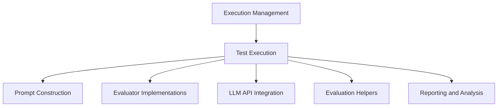

The `test_execution` module is responsible for orchestrating the execution of automated tests and demonstrations within the system. It handles the setup of the environment, agent interaction, action processing, and evaluation of results.

### Architecture Overview

The `test_execution` module is a critical part of the `execution_management` system, interacting with various other modules to perform its functions.

<!-- DIAGRAM_JSON
{
    "direction": "TD",
    "nodes": [
        {"id": "execution_management", "label": "Execution Management", "type": "module", "link": "execution_management.md"},
        {"id": "test_execution", "label": "Test Execution", "type": "module", "link": "test_execution.md"},
        {"id": "prompt_construction", "label": "Prompt Construction", "type": "module", "link": "prompt_construction.md"},
        {"id": "evaluator_implementations", "label": "Evaluator Implementations", "type": "module", "link": "evaluator_implementations.md"},
        {"id": "llm_api_integration", "label": "LLM API Integration", "type": "module", "link": "llm_api_integration.md"},
        {"id": "evaluation_helpers", "label": "Evaluation Helpers", "type": "module", "link": "evaluation_helpers.md"},
        {"id": "reporting_and_analysis", "label": "Reporting and Analysis", "type": "module", "link": "reporting_and_analysis.md"}
    ],
    "edges": [
        {"source": "execution_management", "target": "test_execution"},
        {"source": "test_execution", "target": "prompt_construction"},
        {"source": "test_execution", "target": "evaluator_implementations"},
        {"source": "test_execution", "target": "llm_api_integration"},
        {"source": "test_execution", "target": "evaluation_helpers"},
        {"source": "test_execution", "target": "reporting_and_analysis"}
    ],
    "groups": []
}
-->

### High-Level Functionality

The `test_execution` module primarily provides two core functionalities: `run.test` for automated test execution and `run_demo.test` for interactive demonstration runs. Both functions manage the lifecycle of an agent interacting with a browser environment, capturing trajectories, and handling early stopping conditions.

*   **Automated Test Execution (`run.test`)**
    This component is designed for comprehensive automated testing. It initializes an agent and a browser environment, loads tasks from configuration files, and executes the agent's actions within the environment. It supports various observation types, including those requiring image captioning, and integrates with different evaluators to score the agent's performance. Error handling for OpenAI API calls and other unhandled exceptions is also a key feature.
    Refer to the source code for `run.test` for detailed implementation.

*   **Demonstration Execution (`run_demo.test`)**
    Similar to `run.test`, this component orchestrates agent interactions but is specifically tailored for demonstrations, requiring rendering to be enabled. It focuses on showcasing agent behavior in a visual browser environment. Unlike `run.test`, it does not utilize image captioning for the agent during the demo itself to conserve resources. It also provides output response from the agent for interactive observation.
    Refer to the source code for `run_demo.test` for detailed implementation.